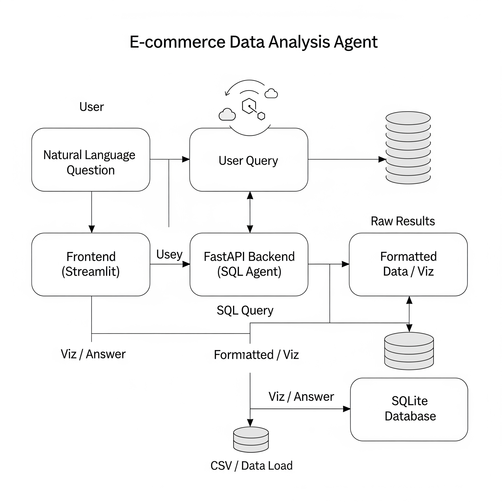
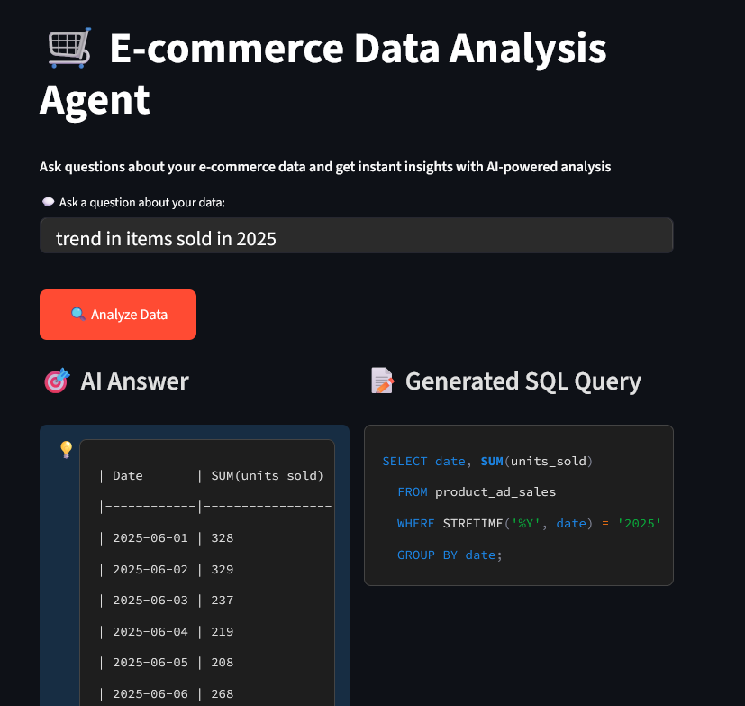
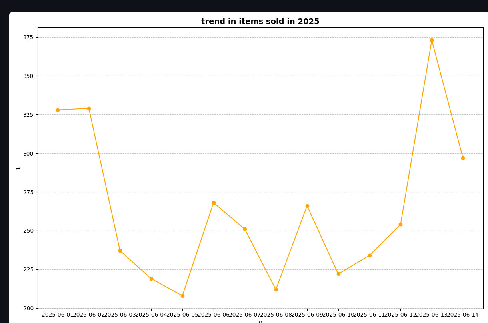

# 🛒 E-commerce Data Analysis Agent

This project is an AI-powered **Data Analysis Agent** built with **FastAPI**, **Streamlit**, and **Gemini LLM**. It allows users to ask natural language questions about their e-commerce data, automatically generates SQL queries, executes them on a SQLite database, formats results, and visualizes the insights.

## **✨ Features**

* **Natural Language to SQL** using Google Gemini LLM.
* **Dynamic Visualization** (bar, line, pie, scatter) of query results.
* **FastAPI Backend API** for query generation and execution.
* **Streamlit Frontend** with a modern, dark-themed UI.
* **Automatic Data Insights** using LLM-based summarization.

## **🧩 Tech Stack**

* **Backend**: FastAPI, SQLite, Google Gemini LLM.
* **Frontend**: Streamlit.
* **Visualization**: Matplotlib, Pandas.
* **Language**: Python 3.10+.

## **⚙️ Setup Instructions**

1. **Clone Repository**
   `git clone https://github.com/yourusername/ecommerce-data-agent.git`
   `cd ecommerce-data-agent`

2. **Create Virtual Environment**
   `python -m venv .venv`
   `source .venv/bin/activate` (Linux/Mac)
   `.venv\Scripts\activate` (Windows)

3. **Install Dependencies**
   `pip install -r requirements.txt`

4. **Add Environment Variables**
   Create a `.env` file with:
   `Geminiapi=YOUR_GOOGLE_GEMINI_API_KEY`

5. **Run Backend (FastAPI)**
   `uvicorn sqlagent_api:app --reload`

6. **Run Frontend (Streamlit)**
   `streamlit run app.py`

## **🔄 System Architecture**

## **📌 Example Usage**

**User Question:**
`What are the top 5 products by total sales?`

**Generated SQL:**
`SELECT Product_ID, SUM(total_sales) AS total_sales FROM product_total_sales GROUP BY Product_ID ORDER BY total_sales DESC LIMIT 5;`

**Answer:**

* Product 21 has the highest sales with \$168,856.46.
* Visualization: Bar Chart of top products.

### AI Answer with Visualization:

### Generated Line Graph:

## **📂 Project Structure**

    Backend/
    ├── sqlagent\_api.py      
    ├── Query.py             
    ├── Graphs.py            
    ├── Promt.py           
    ├── LLM.py              
    ├── resultformat.py      
    Frontend/
    ├── app.py              
    .env
    requirements.txt
    README.md

## **🛠 Future Enhancements**

* Support for multi-table joins.
* Export visualizations as downloadable reports.
* Add authentication for secure access.

